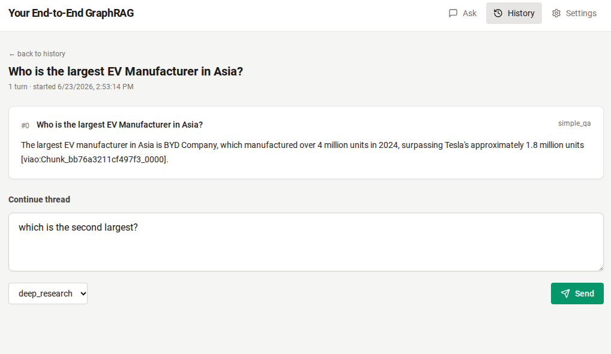

# Your End-to-End GraphRAG Implementation

## Overview

End-to-end GraphRAG platform that ingests your documents, weaves them into an OWL ontology you can curate, and answers questions over the resulting knowledge graph via a React UI plus an MCP server, all deployable to Render with one command.

Three surfaces, one process: REST at `/`, MCP at `/mcp`, and a React UI hosted alongside the backend on Render.

## UI



Conversation view: a prior *simple_qa* turn with its cited answer, plus a *deep_research* follow-up being composed. Top nav switches between **Ask** (single questions), **History** (browse + replay), and **Settings** (paste your bearer token).

## Architecture Notes

**LLMs Used** - Multi-LLM support, currently uses GROQ(for simple tasks) and OpenAI(for more complex reasoning). Will expand to other LLMs in the future.
**Database** - Postgres to hold the knowledge graph and Vectors. I used Supabase but any Postgres DB should work.
**Hosting** - Render for the React UI and MCP Server endpoints. You should be able to move things around to other platforms if you prefer.

## Key differentiators from other RAG and GraphRAG libraries

1. **End-to-end in one tool.** Starts with the raw documents and ends with a deployment of a React UI and an MCP server. Supports Document ingestion → ontology curation → entity + intelligence-artifact extraction → ontology-aware retrieval → React UI + MCP server deployed on Postgres (Supabase) + Render. No glue scripts between stages — every step is a subcommand of the same CLI. UI has basic functionality - multi-turn conversation, ability to store and retrieve old conversations etc.

2. **Ontology-based** Supports import of standard `.rdf` / `.owl` / `.ttl` ontologies and expands them with corpus-driven LLM proposals. Tested with multiple domain specific ontologies across Finance(e.g. FIBO), Pharma( e.g. OCRe, HP), Manufacturing and Supply Chain(OntoCAPE) and general/non-domain specific ones(e.g. FOAF, SKOS). Output is a standard OWL — and can be opened and modified in standard tool such as Protege.

3. **Automatic intelligence-artifact extraction.** Per chunk: typed `Claim` / `Finding` / `Observation` / `Event` artifacts. Per document: `Summary`. Opt-in cross-cluster `Insight` and `Recommendation` artifacts via gpt-4.1 synthesis. Created a new Ontology - **VIAO** - with classes to hold this structure. This defines the artifact taxonomy + edge predicates (`derivedFromChunk`, `assertsAbout`, `insightBasedOn`, etc.) providing traceability. 

4. **Tables as first-class objects.** PDFs are scanned by `pdfplumber` (and gpt-4o-mini vision for nested cases), extracted as JSON-LD, and stored as `StructuredTable` artifacts alongside text chunks. Numeric drill-downs become retrievable via the graph structure.

5. **Time + geography expansion, curated upper ontologies.** Temporal mentions in the corpus auto-expand into a year/quarter/month/day hierarchy with parent creation + gap-fill. Geography rides on existing OWL classes from the merged geography ontology. This allows automatic discovery during RAG (e.g. documents talking about "Jan 2024" are retrievable in queries on "2024" and vice-versa, documents talking about "India" are retrievable in queries on "Asia" and vice-versa) 

6. **Output formatting.** 2 modes of information retrieval - *simple_qa* and *deep_research*. *deep_research* does a deep search, identifies facts, provides the analysis and insights on the facts, identifies claims made and **calls out whether or not the claim is backed with evidence** (I feel this is important), identifies **imbalances in data within the corpus** (e.g. more information on one company/country/product etc. than another - a key issue I see in real world RAG applications). 

## Notes

### Intelligence artifacts

The retrieval layer reads from a typed library of **Intelligence Artifacts** — rows in `graphrag.intelligence_artifacts`, each a typed instance of a VIAO class.

#### The 8 types

| Type | VIAO class | Definition | Generated by | Model |
|---|---|---|---|---|
| **Claim** | `viao:Claim` | A factual assertion the source MAKES (e.g. *"BYD owns 30% of the Vietnamese EV market"*). Specific + verifiable. | `extract-entities` then per-chunk extractor | gpt-4o-mini |
| **Finding** | `viao:Finding` | An analytical conclusion drawn (e.g. *"the trend suggests EV demand is accelerating in ASEAN"*). Goes beyond raw facts. | same prompt, single LLM call per chunk | gpt-4o-mini |
| **Observation** | `viao:Observation` | A raw factual statement directly visible in the text (e.g. *"price rose 5% in March"*). The most concrete of the assertion types. | same prompt | gpt-4o-mini |
| **Event** | `viao:Event` | A happening anchored to a date or date range (study publication, election, founding, regulation effective date, crisis incident). Carries `event_date` / `event_start_date` / `event_end_date` / `event_category` metadata. | same prompt | gpt-4o-mini |
| **Summary** | `viao:Summary` | Condensed ~200-word representation of one Document. | `generate-artifacts` (per doc, once) | gpt-4o-mini |
| **StructuredTable** | `viao:StructuredTable` | JSON-LD representation of a table extracted from a PDF (caption + columns + rows + cells). Full payload lives in `extra_metadata` JSONB. | `prune-expand --tables` writes JSON-LD; `register-documents --tables` ingests it | pdfplumber + gpt-4o-mini vision |
| **Insight** | `viao:Insight` | Cross-cluster synthesis. Non-obvious pattern across many Claims/Findings tied to the same ontology class. **Opt-in** via `--type Insight`. | `generate-artifacts --type Insight` clusters by entity `class_id` | **gpt-4.1** |
| **Recommendation** | `viao:Recommendation` | Actionable judgment derived from clustered Insights. **Opt-in** via `--type Recommendation`. | `generate-artifacts --type Recommendation` clusters Insights via embedding k-means | **gpt-4.1** |

#### What gets derived from what

| Source node | Artifacts produced |
|---|---|
| **Document** (1 row per ingested file) | 1 `Summary` (always) · N `StructuredTable`s (PDFs with `--tables` only) |
| **Chunk** (1+ per document after summarization + chunking) | ~0–8 each of `Claim`, `Finding`, `Observation`, `Event` per chunk (single LLM call returns all 4 types) |
| **Cluster of Claim+Finding** (grouped by ontology class via the entity's `class_id`) | 1–3 `Insight`s per qualifying cluster (default threshold ≥10 attached artifacts) |
| **Cluster of Insights** (grouped by embedding k-means) | 1–3 `Recommendation`s per theme |

Ontology classes, entities, and time instances are *referenced* by artifacts (via `assertsAbout`, `inPeriod`) but do not themselves produce artifacts.

#### Derivation hierarchy (mirrors VIAO predicates)

```
            Document
              │ ─────────────────────────┐
              │ has chunks               │ derivedFromDocument / summarizes
              ▼                          ▼
            Chunk                  Summary  +  StructuredTable (PDFs only)
              │
              │ derivedFromChunk
              ▼
       ┌──────┼──────┬──────────┐
       ▼      ▼      ▼          ▼
     Claim  Finding  Observation  Event
       │      │
       │   insightBasedOn
       └──────┘
           │
           ▼
        Insight                   ── cross-class synthesis (opt-in, gpt-4.1)
           │
           │ recommendationBasedOn
           ▼
     Recommendation               ── cross-Insight (opt-in, gpt-4.1)
```

#### Per-artifact metadata in `extra_metadata` JSONB

| Type | Fields |
|---|---|
| `Claim` / `Finding` / `Observation` | `evidence_status` (`"backed"`/`"partial"`/`"unbacked"` — whether the chunk supplies reasoning) · `claim_source` (who made the claim) · `time_scope` (what period the claim applies to) |
| `Event` | `event_date` / `event_start_date` / `event_end_date` (YYYY-MM-DD strings) · `event_category` (free-text label like *"study"*, *"election"*, *"founding"*) |
| `StructuredTable` | Full JSON-LD bundle: `caption`, `pageNumber`, `extractionMethod`, `columns[]`, `rows[]`, `cells[]` |
| `Insight` / `Recommendation` | `cluster_class` (the ontology class the cluster came from) · base-Claim/Insight references via `artifact_sources` M2M |

#### Entity grounding + traceability

When a chunk has entities attached (from `extract-entities`), the per-chunk extraction prompt lists those entities and **requires** the LLM to use exact canonical names — no *"the company"* / *"the manufacturer"* substitution. For each entity whose canonical name then appears in an artifact's text, an `Artifact → viao:assertsAbout → Entity` edge is written, giving you the citation chain *artifact → asserted entity → typed ontology class*.

Every artifact lives in `graphrag.intelligence_artifacts` with a `vector(1024)` embedding over `(title + text)` and a `graph_version` stamp. Full traceability:

```
Answer → retrieval_evidence → intelligence_artifacts → artifact_sources → chunks → documents → file_path
```

### The document-summarization prompt

This is the single biggest knob for retrieval quality on your specific corpus. Generic prose summarization works for most domains, but if your corpus has unusual structure (clinical trials, legal contracts, technical specs, scientific papers), you'll want to teach the summarizer what to preserve.

Documents above `chunking.summarization_threshold_tokens` (default 2,000 tokens in [config/config.yaml](config/config.yaml)) are compressed via gpt-4o-mini before chunking + embedding. The summary — not the raw text — is what gets embedded and stored on `chunks.text`; `documents.file_path` still points at the original so citations resolve back to source.

**Designed to keep** (per the current prompt):

- Named entities (countries, regions, companies, products, people, regulations, dates, monetary amounts, measurements)
- Conceptual categories (industries, sectors, technologies, materials, processes, frameworks)
- Relationships between entities (X causes Y, X is part of Y, X exports Y, etc.)
- Numerical specifics tied to a named thing
- Intelligence-bearing fragments rendered as standalone sentences: **Events** (with dates), **Claims** (with source attribution), **Findings**, **Risks**, **Insights**

The prompt lives in `document_summarize` at [prompts.py:711-792](backend/app/services/prompts.py#L711-L792). After editing, **bump `_DOC_SUMMARY_PROMPT_VERSION`** at [pipeline_llm.py:1518](backend/app/services/pipeline_llm.py#L1518) to invalidate the on-disk summary cache so old summaries get regenerated under the new rules.

## Usage guide

### 1. Clone + install

```bash
git clone https://github.com/vvr-rao/your-end-to-end-graphrag-implementation
cd your-end-to-end-graphrag-implementation
uv sync
```

Requires Python 3.12 and [uv](https://github.com/astral-sh/uv). Frontend separately needs Node 18+ (only needed for local UI dev, not deployment).

### 2. Configure secrets + tuning

```bash
cp .env.example .env
cp config/config.example.yaml config/config.yaml
cp config/models.example.yaml config/models.yaml
```

Fill `.env` with:

| Var | Required | How to get it |
|---|---|---|
| `DATABASE_URL` | yes | Supabase → Project Settings → Database → **Session pooler** URL (don't use the direct `db.*.supabase.co` URL — IPv6-only) |
| `OPENAI_API_KEY` | yes | https://platform.openai.com/api-keys |
| `BEARER_TOKEN` | yes | `python -c "import secrets; print(secrets.token_urlsafe(32))"` |
| `GROQ_API_KEY` | optional | Only needed if you use the Groq-backed Stage 1 in ontology expansion |
| `RENDER_API_KEY` | optional | Only needed for Render deploy — https://dashboard.render.com/u/settings#api-keys |

`pgvector` must be enabled in Supabase: Dashboard → Database → Extensions → toggle on **vector**.

### 3. Build the ontology

Drop your source ontologies in `source_ontologies/` (any combination of `.owl`, `.rdf`, `.ttl`, `.zip`). Two CLI paths:

```bash
# Deterministic merge (no LLM cost). Combines multiple input ontologies.
# NOTE: you HAVE TO import the VIAO ontology - core_ontologies/viao_intelligence_artifact_ontology_v2.owl
# Strongly recommend you also import the other core ontologies as they are handled especially well and cover areas like people, time, geographies

#EXAMPLE FROM FINANCE DOMAIN
uv run python -m backend.app.cli merge \
  --ontology source_ontologies/core_ontologies/viao_intelligence_artifact_ontology_v2.owl \
  --ontology source_ontologies/core_ontologies/foaf.rdf \
  --ontology source_ontologies/core_ontologies/org.ttl \
  --ontology source_ontologies/core_ontologies/geography_ontology.owl \
  --ontology source_ontologies/core_ontologies/time.ttl \
  --ontology source_ontologies/core_ontologies/skos.rdf \
  --ontology source_ontologies/core_ontologies/domain_concepts.owl \
  --ontology source_ontologies/finance_ontologies/prod.rdf.zip

#EXAMPLE FROM PHARMA DOMAIN
uv run python -m backend.app.cli merge \
  --ontology source_ontologies/core_ontologies/viao_intelligence_artifact_ontology_v2.owl \
  --ontology source_ontologies/core_ontologies/foaf.rdf \
  --ontology source_ontologies/core_ontologies/org.ttl \
  --ontology source_ontologies/core_ontologies/geography_ontology.owl \
  --ontology source_ontologies/core_ontologies/time.ttl \
  --ontology source_ontologies/core_ontologies/skos.rdf \
  --ontology source_ontologies/core_ontologies/domain_concepts.owl \
  --ontology source_ontologies/pharma_ontologies/OCRe.zip \
  --ontology source_ontologies/pharma_ontologies/hp.owl

#EXAMPLE FROM SUPPLY CHAIN/GLOBAL GEOPOLITICS
uv run python -m backend.app.cli merge \
  --ontology source_ontologies/core_ontologies/viao_intelligence_artifact_ontology_v2.owl \
  --ontology source_ontologies/core_ontologies/foaf.rdf \
  --ontology source_ontologies/core_ontologies/org.ttl \
  --ontology source_ontologies/core_ontologies/geography_ontology.owl \
  --ontology source_ontologies/core_ontologies/time.ttl \
  --ontology source_ontologies/core_ontologies/skos.rdf \
  --ontology source_ontologies/core_ontologies/domain_concepts.owl \
  --ontology source_ontologies/manufacturing_supplychain_ontologies/OntoCAPE_domain+ontology.zip


# LLM-driven prune-expand against a document corpus.
# Drops classes the corpus doesn't reference; proposes new classes for
# concepts that aren't yet represented. Output is standard OWL.
uv run python -m backend.app.cli prune-expand \
  --input output_ontologies/v<TS>-merge/ \
  --documents source_documents/<your-corpus>

# Same, but ALSO extract tables from every PDF in the corpus (Phase 2a).
# Writes table JSON-LD to <output>/tables/<sha>.jsonld for later DB ingestion.
uv run python -m backend.app.cli prune-expand \
  --input output_ontologies/v<TS>-merge/ \
  --documents source_documents/<your-corpus> \
  --tables
```

Each subcommand writes a versioned folder `output_ontologies/v<UTC-timestamp>-<subcommand>/` containing `merged.owl` (Protégé-readable), `merged.json` (canonical re-loadable form), `manifest.json`, `stats.json`, and `llm_audit.jsonl`.

Hand-suggesting additional classes via `--suggested-new-classes`:

```bash
cp suggested_new_classes.example.json suggested_new_classes.json
# Edit the JSON to list any classes you want minted even if no chunk surfaces them.
uv run python -m backend.app.cli prune-expand \
  --input output_ontologies/v<TS>-merge/ \
  --documents source_documents/<your-corpus> \
  --suggested-new-classes suggested_new_classes.json
```

Protect your in-house ontologies from prune by listing their IRI prefixes under `ontology.protected_iri_prefixes` in `config/config.yaml`.

### 4. Initialize the database

```bash
# Apply Alembic migrations, then import the ontology with embeddings.
# 'replace' mode wipes the 4 ontology tables first (safe — refuses if
# dependent tables like entities/artifacts are non-empty).
uv run python -m backend.app.cli db-init \
  --input output_ontologies/v<TS>-prune-expand --mode replace --yes

# Read-only inspection
uv run python -m backend.app.cli db-status
uv run python -m backend.app.cli db-size
```

### 5. Ingest documents

```bash
# Smoke-test with 5 docs first
uv run python -m backend.app.cli register-documents \
  --input source_documents/<your-corpus> --limit 5

# Full corpus
uv run python -m backend.app.cli register-documents \
  --input source_documents/<your-corpus>

# Same, but also load any pre-extracted table JSON-LD from
# prune-expand --tables as StructuredTable artifacts
uv run python -m backend.app.cli register-documents \
  --input source_documents/<your-corpus> --tables
```

### 6. Enrich time

No LLM, no cost — regex + calendar math. Detects year/quarter/month/day mentions in every chunk, mints parent + gap-fill `time_instances`, and wires chunks via `time:inPeriod` edges.

```bash
uv run python -m backend.app.cli enrich-time
```

### 7. Extract entities

Per-chunk LLM call (gpt-4o-mini) that mints `Entity` rows tied to existing `OntologyClass` rows. Required before `generate-artifacts` so artifacts can be entity-grounded.

```bash
uv run python -m backend.app.cli extract-entities --max-cost-usd 1.0
```

### 8. Generate intelligence artifacts

```bash
# Per-chunk Claims + Findings + Observations + Events (single LLM call
# per chunk) and per-doc Summaries. Default flow, gpt-4o-mini.
uv run python -m backend.app.cli generate-artifacts --max-cost-usd 2.0

# Opt-in cross-cluster synthesis (gpt-4.1 — more expensive)
uv run python -m backend.app.cli generate-artifacts --type Insight
uv run python -m backend.app.cli generate-artifacts --type Recommendation
```

### 9. Ask questions

Two modes: `simple_qa` (tight 1-3 sentence direct answer) and `deep_research` (**default** — structured 7-section answer: SPECIFICS → ANALYSIS → ANSWER → CONTRADICTIONS → KEY CLAIMS → COVERAGE IMBALANCE → KEY INSIGHTS).

```bash
# One-shot question (default = deep_research)
uv run python -m backend.app.cli query \
  "What are the regulations around EV production in Asia?"

# Tight factoid answer
uv run python -m backend.app.cli query --mode simple_qa \
  "What is OCI N.V.'s annual nitrogen fertilizer production capacity?"

# Multi-turn conversation with automatic follow-up resolution
CONV=$(uv run python -m backend.app.cli conversation start | grep '^iri:' | awk '{print $2}')
uv run python -m backend.app.cli conversation turn --conv "$CONV" \
  "What does the corpus say about EV production?"
uv run python -m backend.app.cli conversation turn --conv "$CONV" \
  "And how does Vietnam compare specifically?"   # resolved against prior turn
uv run python -m backend.app.cli conversation show --conv "$CONV"
```

Or use the React UI / MCP server (see deploy section).

### 10. Deploy to Render

Two services on Render: a Docker web service (FastAPI + MCP at `/mcp`) and a static site (the React UI). Postgres stays external at Supabase. One CLI command, plus a one-time GitHub App install.

#### One-time GitHub App install

Render needs read access to your repo before its API can fetch from it. If `render-init` errors with `Render API 400: ... unfetchable: https://github.com/...`, the GitHub App isn't installed yet. Two paths — whichever you find faster:

**Path A — install directly from GitHub** (most reliable):
1. Go to https://github.com/apps/render
2. Click **Install** (or **Configure** if it's already there)
3. Pick your GitHub account/org
4. Either "All repositories" or pick this repo
5. Click **Install** / **Save**

**Path B — trigger the OAuth from Render's New-Service flow:**
1. Render dashboard → **New +** → **Web Service**
2. Click the "Connect GitHub" or "Configure GitHub App" button
3. Authorize → install on the repo
4. Don't actually create a service from this page — close the tab once GitHub is connected

#### Deploy

```bash
uv run python -m backend.app.cli render-init
```

One command. Reads `render.yaml` + `.env` + your git origin/branch, creates both services on Render, sets env vars (including pushing your `OPENAI_API_KEY`, `DATABASE_URL`, `BEARER_TOKEN` from `.env`), cross-links `FRONTEND_ORIGIN` ↔ `VITE_API_BASE_URL`, and triggers the first deploys. Idempotent — safe to re-run.

Add `--no-deploy` to create the services without auto-triggering builds.

After ~5-8 min the backend reaches `live`. Open the printed frontend URL → /settings → paste your `BEARER_TOKEN` → /ask.

### 11. Monitor, suspend, terminate

```bash
# State of both services + last-deploy status
uv run python -m backend.app.cli render-status

# Tail logs
uv run python -m backend.app.cli render-logs --service backend --since 10m

# Force a fresh build
uv run python -m backend.app.cli render-deploy --service backend --wait

# Pause compute (free-tier hours stop accruing); fully reversible
uv run python -m backend.app.cli render-suspend --all
uv run python -m backend.app.cli render-resume --all

# Same as suspend --all (alias)
uv run python -m backend.app.cli render-takedown --yes

# Delete both services entirely (irreversible — URLs reassigned next render-init)
uv run python -m backend.app.cli render-takedown --hard --yes
```

#### Render Free-tier limits

- **Web service**: 750 instance-hours per workspace per month. Sleeps after 15 min idle; first request after sleep takes 30-60s to wake.
- **Static site**: 100 GB bandwidth + 500 build minutes/month; never sleeps.
- **No free Postgres, Redis, or persistent disks** — Postgres lives at Supabase.

The UI's `LoadingSpinner` switches copy to warn about cold start after 5s.

## LLM provider routing

Task → provider/model map lives in `config/models.yaml`. Defaults:

| Task | Provider | Model |
|---|---|---|
| `chunk_classification` (ontology expansion Stage 1) | Groq | `llama-3.3-70b-versatile` |
| `class_proposal`, `match_dedup` (ontology expansion Stages 2–3) | OpenAI | `gpt-4.1` |
| `class_summarization`, `document_summarize`, `compact_description` | OpenAI | `gpt-4o-mini` |
| `entity_extract`, `question_parse`, `concept_expansion`, `query_decompose`, `follow_up_resolution` | OpenAI | `gpt-4o-mini` |
| `artifact_chunk_extract_with_entities` (Claim / Finding / Observation / Event extraction) | OpenAI | `gpt-4o-mini` |
| `answer_simple_qa`, `answer_conversation_turn` | OpenAI | `gpt-4o-mini` |
| `answer_deep_research`, `insight_gen`, `recommendation_gen` | OpenAI | `gpt-4.1` |
| `embeddings` | OpenAI | `text-embedding-3-small` @ 1024 dim |

`OPENAI_API_KEY` is required; `GROQ_API_KEY` is only needed if you use the Groq-backed Stage 1 in ontology expansion.

## Source-document downloaders

Three standalone scripts under `source_documents/` help seed a corpus quickly. Each accepts `--search` / `--output` / `--max`.

```bash
# DailyMed (NLM drug PIL PDFs)
uv run python source_documents/dailymed_download.py \
  --search "diabetes" --max 10

# Web search top-N pages as plain text (DuckDuckGo SERP)
uv run python source_documents/websearch_download.py \
  --search "GraphRAG ontology techniques" --max 5

# SEC EDGAR filings. Most US 10-Ks ship as iXBRL only — pass --allow-html
# to fall back to the primary HTML 10-K body and convert to PDF via WeasyPrint.
uv run python source_documents/financial_report_download.py \
  --search "Apple Inc" --max 5 --allow-html --forms "10-K,20-F"
```

Edit the `CONTACT` constant at the top of `financial_report_download.py` before running — SEC EDGAR blocks generic User-Agents.

You can also download standard ontologies into `source_ontologies/`:

```bash
uv run python source_ontologies/download_ontology.py \
  "https://github.com/obophenotype/human-phenotype-ontology/releases/latest/download/hp.owl" \
  "./source_ontologies/pharma_ontologies"
```

## Inspecting an ontology

Open any generated `merged.owl` directly in [Protégé](https://protege.stanford.edu/). The full class taxonomy, properties, and instances are visible there with no further setup.

## Layout

```
backend/
  app/
    api/         # FastAPI routes (auto-exposed via MCP at /mcp)
    core/        # config, db, logging
    db/          # SQLAlchemy models + Alembic migrations
    helpers/     # ontology parsing + pruning helpers
    jobs/        # arq workers (scaffold; not currently used)
    ontology/    # OWL export, IRI utilities
    services/    # ontology I/O, persistence, embeddings, LLM router, retrieval, render client
    cli/         # all subcommands listed above
  Dockerfile     # uv-based image used by the Render web service
frontend/        # Vite + React + TS + Tailwind UI
config/          # *.example.yaml tracked; *.yaml gitignored
source_ontologies/   # drop .owl / .rdf / .ttl source files here (subfolders gitignored)
source_documents/    # drop PDFs / TXTs here (everything except notes.md gitignored)
output_ontologies/   # versioned merge / prune-expand outputs land here
render.yaml      # Render blueprint
```

## Appendix — how the ontology pipeline works

The LLM-driven subcommands (`prune`, `expand`, `prune-expand`, `build`) share a 4-stage pipeline; they differ only in which deterministic transformation Stage 4 applies. Lives in [backend/app/services/pipeline_llm.py](backend/app/services/pipeline_llm.py).

| Stage | Task | Model | What it does |
|---|---|---|---|
| 1 | `chunk_classification` | Groq · `llama-3.3-70b-versatile` | Per chunk, asks the model which **top-level ontology branches** the chunk is plausibly relevant to. Returns a short IRI list. Narrowing step — the full classes_dict for a mid-size ontology is well over 1M tokens, so Stage 2 can't see it whole on every chunk. |
| 2 | `class_proposal` | OpenAI · `gpt-4.1` | Per chunk, with the chunk text + a **sliced sub-ontology** (every class within `max_hops` of any Stage-1 IRI), asks: which IRIs does this chunk talk about? what new classes does it need? what relationships does it assert? Outputs `MATCHES FOUND` / `MATCH NOT FOUND` / `MATCH NOT FOUND RELATIONS`. |
| 3 | `match_dedup` | OpenAI · `gpt-4.1` (one call total) | Consolidates Stage 2 outputs: collapses proposed new classes that are the same concept under different labels; drops proposed classes that duplicate existing matches; dedups relation labels. |
| 4 | (none — pure Python) | — | Builds the keep-set: seeds from `MATCHES FOUND` + ancestor + descendant closure via `subClassOf` + relationship partners + `protected_iri_prefixes`. Mints new classes + relations from the deduped proposals. Writes `merged.json` + `merged.owl` + manifest + stats + audit log. |

The Stage 1 → Stage 2 narrowing is the whole reason this scales. Without it every chunk would either need to see the full ontology (won't fit in any model's context for mid-size ontologies) or have no ontology context at all (which collapses prune/expand into raw generation).

#### Multi-file merge details

`merge` handles:
- Single `.owl` / `.rdf` / `.ttl` — parsed directly via owlready2 in its own isolated `World()`.
- `.zip` archives (e.g. FIBO, OntoCAPE) — extracted to a temp directory; each file loaded into its own per-file `World()` so triples don't accumulate across files.
- Cross-file `owl:imports` — resolved to local copies via an IRI map (OASIS `catalog-v001.xml`, FIBO's HTTPS imports, OntoCAPE's `file:/C:/...` Windows-style imports).
- HTTP(S) imports owlready2 doesn't already know about — stripped from the extracted copies so owlready2 doesn't hang on a TCP SYN trying to fetch them.
- Per-file failures (defective XML, owlready2 incompatibility) — logged and skipped so one bad file doesn't kill the whole merge.
