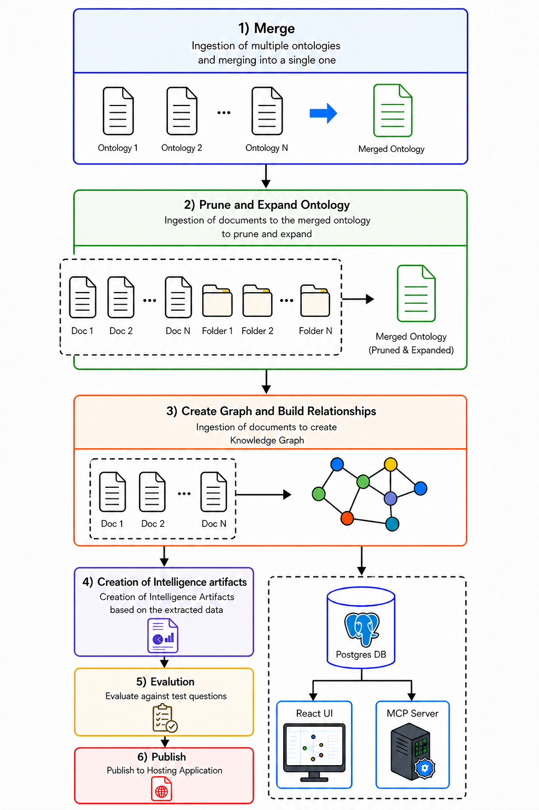
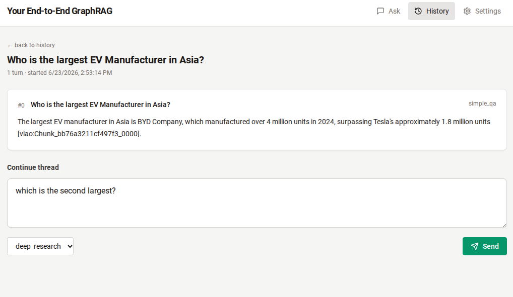

<div align="center">

# Your End-to-End GraphRAG Implementation (YEGI)

</div>

[](https://github.com/vvr-rao/your-end-to-end-graphrag-implementation/actions/workflows/ci.yml)
[](https://www.python.org/downloads/)
[](LICENSE)

_Requires Python 3.12+. CI runs the test suite on CPython 3.12, 3.13, and 3.14._

## Overview
**CLI based End-to-end GraphRAG Tool** that ingests your documents, weaves them into an OWL ontology you can curate, populates a fully connected Knowledge Graph, implements a RAG system with automated evaluation and scoring  and publishes the entire system as a **React based UI**, **MCP Server** and a **Postgres database** all via the CLI.

Three surfaces, one process: REST at `/`, MCP at `/mcp`, and a React UI hosted on Render alongside the backend on Postgres.

> **v3 — 2026-07-27:** YEGI now ships as a **Claude Code extension**. Clone the repo, open [Claude Code](https://claude.com/claude-code), and _chat_ your way through the entire build — choose an LLM mode, set up the database, merge ontologies, run prune-expand, ingest documents, and deploy — with the long steps run and monitored for you. See **[Build it by chatting with Claude Code](#build-it-by-chatting-with-claude-code)**.

I have tested this using open source data and common ontologies from Pharma, Finance and Manufacturing and Supply Chain domains.
<div align="center">



</div>

## Why YEGI?

1. **End-to-end in one tool.** Starts with the raw documents and ends with a deployment of a React UI and an MCP server. Supports Document ingestion → ontology curation → entity + intelligence-artifact extraction → ontology-aware retrieval → React UI + MCP server deployed on Postgres (Supabase) + Render. No glue scripts between stages — every step is a subcommand of the same CLI. UI has basic functionality - multi-turn conversation, ability to store and retrieve old conversations, etc.

2. **Ontology-based.** Supports import of standard `.rdf` / `.owl` / `.ttl` ontologies and expands them with corpus-driven LLM proposals. Tested with multiple domain specific ontologies across Finance(e.g. FIBO), Pharma( e.g. OCRe, HP), Manufacturing and Supply Chain(OntoCAPE) and general/non-domain specific ones(e.g. FOAF, SKOS). Output is a standard OWL file — and can be opened and modified in a standard tool such as Protege.

3. **RAG Intelligence - not just RAG Retrieval.** `Deep Research` mode provides detailed answers and analysis including `evidence tracking for claims`, `analysis and insights`, `coverage gaps` in the corpus and  `differing opinions` and `contradictions` in the data. Per chunk: typed `Claim` / `Finding` / `Observation` / `Event` artifacts. Per document: `Summary`. Opt-in cross-cluster `Insight` and `Recommendation` artifacts via LLM synthesis. I have created a new Ontology - **VIAO** - with classes to hold this structure. This defines the artifact taxonomy + edge predicates (`derivedFromChunk`, `assertsAbout`, `insightBasedOn`, etc.) providing traceability. 

4. **Tables as first-class objects.** PDFs are scanned by `pdfplumber` (and gpt-4o-mini vision for nested cases), extracted as JSON-LD, and stored as `StructuredTable` artifacts alongside text chunks. Numeric drill-downs become retrievable via the graph structure.

5. **Time + geography expansion, curated upper ontologies.** Temporal mentions in the corpus auto-expand into a year/quarter/month/day hierarchy with parent creation + gap-fill. Geography rides on existing OWL classes from the merged geography ontology. This allows automatic discovery during RAG (e.g. documents talking about "Jan 2024" are retrievable in queries on "2024" and vice-versa, documents talking about "India" are retrievable in queries on "Asia" and vice-versa). 

6. **Identity layer - corpus-mined synonyms and acronyms.** The same thing is rarely called the same thing twice (brand vs generic drug name, ticker vs company, acronym vs expansion, nickname vs full name), and embeddings do NOT know these are equivalent - e.g.`tirzepatide` and `MOUNJARO` are as far apart in vector space as two unrelated words. The system mines these equivalences out of the corpus itself, deterministically and with no LLM, by reading the conventions authors already use e.g. (`MOUNJARO (tirzepatide)`, `Securities and Exchange Commission (SEC)`, `also known as`) plus any `skos:altLabel` annotations in your ontology. The pairs then widen graph seeding, ride into the vector probes, survive misspelled queries, and are handed to the answer LLM so it treats the names as one entity. See **[Identity Layer](#identity-layer)**.

7. **Output formatting.** Two modes of information retrieval - *simple_qa* and *deep_research*. *deep_research* does a deep search, identifies facts, provides the analysis and insights on the facts, identifies claims made and **calls out whether or not the claim is backed with evidence** (I feel this is important), identifies **imbalances in data within the corpus** (e.g. more information on one company/country/product etc. than another - a key issue I see in real world RAG applications). 

### Platform support

**LLMs Used** - Multi-LLM support via config presets: default (Groq + OpenAI), OpenAI-only, or Anthropic-only chat. Provider/model per task is set in `config/models.yaml`. Embeddings always run on OpenAI (Anthropic has no embeddings API).

**Database** - Postgres to hold the knowledge graph and Vectors. A cloud based Postgres DB (e.g. Supabase/AWS RDS) works. If none is provided, one is created in a local Docker for you. It needs to have pgvector enabled.

**Hosting(optional)** - Render for the React UI and MCP Server endpoints. You should be able to move things around to other platforms if you prefer.

**Claude Code(optional but recommended)** - 
The Claude Code build flow works natively on **Linux, macOS, and Windows**. The skills drive small cross-platform **Python helpers** invoked with `uv run python` — and the skill commands are written **shell-neutrally** (no bash arrays, `$(…)` capture, `tail`/`head` pipes, line-continuations, or `python3`-only names), so they run unchanged in any shell. The durable-run harness (`scripts/run_detached.py`) uses the OS's own process-session primitives — no `setsid` dependency. On **Windows**, Claude Code uses **Git Bash** if [Git for Windows](https://git-scm.com/downloads/win) is installed, otherwise its **PowerShell tool**; the shell-neutral commands work under either. [WSL2](https://learn.microsoft.com/windows/wsl/install) is still the smoothest Windows path (a full Linux environment, plus the best Docker / Postgres / `uv` support). CI exercises the helpers + harness on Linux, macOS, **and** Windows; the end-to-end *conversational* flow isn't CI-driven, so native Windows is best-effort-but-supported. `uv` and Python 3.12+ are required everywhere. Caching is filesystem-based under `~/.cache/…` and works on every platform.

## UI



Conversation view: a prior *simple_qa* turn with its cited answer, plus a *deep_research* follow-up being composed. Top nav switches between **Ask** (single questions), **History** (browse + replay), and **Settings** (paste your bearer token).

## Build it by chatting with Claude Code

**New in v3.** YEGI includes a set of [Claude Code](https://claude.com/claude-code) skills so you can build the whole system by talking to Claude instead of running each CLI command yourself. Clone the repo, open Claude Code inside it, and say **"where do I start"** (or "build the app").

### Prerequisites

A `git clone` gets you everything in the repo — the skills, config templates, the credential firewall, the durable-run harness, and the bundled OCRe + FIBO ontologies. You supply a few things the clone can't:

**Install once** (per machine):

- **[Claude Code](https://claude.com/claude-code)** — the build skills only run inside it.
- **[uv](https://github.com/astral-sh/uv)** — runs the app and manages Python 3.12+ for you, so you don't install Python separately (`brew install uv`, or the official installer).
- **Git** — to clone (on macOS, `xcode-select --install` provides git and a base `python3`).
- **[Docker Desktop](https://www.docker.com/products/docker-desktop/)** — **only if** you want the local database; not needed with a hosted Postgres (Supabase).

**Provide** (your own inputs — the skills create `.env` from the template; you fill in the secrets, never in chat):

- **API keys** in `.env`: `OPENAI_API_KEY` (always — embeddings run on OpenAI), plus `GROQ_API_KEY` / `ANTHROPIC_API_KEY` for those modes, and `RENDER_API_KEY` if you deploy.
- **A database**: a Supabase (or any Postgres) connection string, or let the skill spin up a local docker-compose Postgres.

**Do you need Docker?** Only for a local DB:

| Database choice | Docker needed? |
|---|---|
| Supabase / any hosted Postgres | No |
| Local docker-compose Postgres | Yes |

If you plan to deploy to Render, use a hosted Postgres from the start — the deployed app can't reach a local Docker DB — so that path needs no Docker at all.

**First run:** Claude Code will ask you to approve the repo's `.claude/settings.json` (it carries the SessionStart progress hook and the credential-firewall deny rules). Approve it so the cross-session tracker and `.env` protection take effect.

Then it's chat-and-go:

```bash
git clone <your-fork-or-this-repo>
cd your-end-to-end-graphrag-implementation
uv sync            # one-time dependency install
# open Claude Code here, then say:  "where do I start"
```

Claude then walks you through, one step at a time:

1. **Pick an LLM mode** — Groq+OpenAI, OpenAI-only, or Anthropic+OpenAI — and activate the matching config preset.
2. **Set up the database** — paste your own Postgres/Supabase connection string, or let Claude bring up a local docker-compose Postgres automatically.
3. **Merge the ontology** — choose a supported domain (Pharma → OCRe, Finance → FIBO, Manufacturing / Supply-chain → OntoCAPE), bring your own `.owl` / `.rdf`, or use just the core ontologies. Claude fetches the domain ontology and merges it with the core set, then asks you to eyeball the result in Protégé.
4. **prune-expand → ingest → enrich → generate artifacts** — the long, paid steps run **detached** (they survive a closed session) and Claude monitors them, reporting progress and cost.
5. **Deploy to Render.**

What makes it safe and resumable:

- **Credentials never touch the chat.** You put API keys and the DB URL in `.env` yourself; Claude is blocked from reading secret files and only checks that a key is *present*.
- **Long jobs survive a killed session.** Steps that run for hours are detached — close Claude Code and they keep going.
- **Cross-session memory.** Progress is tracked on disk, so a *new* session knows what you did last. Ask **"what's the status"** or **"what did we do last"** and Claude resumes where you left off.

### Deploying to Render — fork the repo first

Render deploys from **your** GitHub repository via the `render.yaml` blueprint, so to deploy you must **fork this repo to your own GitHub account** (or push a copy there), then point Claude / `render-init` at your fork. You can build and run everything locally without forking — the fork is only needed for the Render deploy step.


## Notes

### Intelligence artifacts

The retrieval layer reads from a typed library of **Intelligence Artifacts** — rows in `graphrag.intelligence_artifacts`, each a typed instance of a VIAO class.

#### The 8 types

| Type | VIAO class | Definition | Generated by | Model |
|---|---|---|---|---|
| **Claim** | `viao:Claim` | A factual assertion the source MAKES (e.g. *"BYD owns 30% of the Vietnamese EV market"*). Specific + verifiable. | `extract-entities` then per-chunk extractor | gpt-4o-mini |
| **Finding** | `viao:Finding` | An analytical conclusion drawn (e.g. *"the trend suggests EV demand is accelerating in ASEAN"*). Goes beyond raw facts. | same prompt, single LLM call per chunk | gpt-4o-mini |
| **Observation** | `viao:Observation` | A raw factual statement directly visible in the text (e.g. *"price rose 5% in March"*). The most concrete of the assertion types. | same prompt | gpt-4o-mini |
| **Event** | `viao:Event` | A happening anchored to a date or date range (study publication, election, founding, regulation effective date, crisis incident). Carries `event_date` / `event_start_date` / `event_end_date` / `event_category` metadata. | same prompt | gpt-4o-mini |
| **Summary** | `viao:Summary` | The document's lossless section-structured `text_summary` verbatim (produced at ingest by the evaluated summarizer — no extra LLM call here), then auto-rolled-up into higher-level Summary layers. | `generate-artifacts` (per doc, once; auto-rollup) | none (verbatim) · rollup uses gpt-4.1 |
| **StructuredTable** | `viao:StructuredTable` | JSON-LD representation of a table extracted from a PDF (caption + columns + rows + cells). Full payload lives in `extra_metadata` JSONB. | `prune-expand --tables` writes JSON-LD; `register-documents --tables` ingests it | pdfplumber + gpt-4o-mini vision |
| **Insight** | `viao:Insight` | Cross-cluster synthesis. Non-obvious pattern across many Claims/Findings tied to the same ontology class. **Opt-in** via `--type Insight`. | `generate-artifacts --type Insight` clusters by entity `class_id` | **gpt-4.1** |
| **Recommendation** | `viao:Recommendation` | Actionable judgment derived from clustered Insights. **Opt-in** via `--type Recommendation`. | `generate-artifacts --type Recommendation` clusters Insights via embedding k-means | **gpt-4.1** |

#### What gets derived from what

| Source node | Artifacts produced |
|---|---|
| **Document** (1 row per ingested file) | 1 `Summary` (always) · N `StructuredTable`s (PDFs with `--tables` only) |
| **Chunk** (1+ per document after summarization + chunking) | ~0–8 each of `Claim`, `Finding`, `Observation`, `Event` per chunk (single LLM call returns all 4 types) |
| **Cluster of Claim+Finding** (grouped by ontology class via the entity's `class_id`) | 1–3 `Insight`s per qualifying cluster (default threshold ≥10 attached artifacts) |
| **Cluster of Insights** (grouped by embedding k-means) | 1–3 `Recommendation`s per theme |

Ontology classes, entities, and time instances are *referenced* by artifacts (via `assertsAbout`, `inPeriod`) but do not themselves produce artifacts.

#### Derivation hierarchy (mirrors VIAO predicates)

```
            Document
              │ ─────────────────────────┐
              │ has chunks               │ derivedFromDocument / summarizes
              ▼                          ▼
            Chunk                  Summary  +  StructuredTable (PDFs only)
              │
              │ derivedFromChunk
              ▼
       ┌──────┼──────┬──────────┐
       ▼      ▼      ▼          ▼
     Claim  Finding  Observation  Event
       │      │
       │   insightBasedOn
       └──────┘
           │
           ▼
        Insight                   ── cross-class synthesis (opt-in, gpt-4.1)
           │
           │ recommendationBasedOn
           ▼
     Recommendation               ── cross-Insight (opt-in, gpt-4.1)
```

#### Per-artifact metadata in `extra_metadata` JSONB

| Type | Fields |
|---|---|
| `Claim` / `Finding` / `Observation` | `evidence_status` (`"backed"`/`"partial"`/`"unbacked"` — whether the chunk supplies reasoning) · `claim_source` (who made the claim) · `time_scope` (what period the claim applies to) |
| `Event` | `event_date` / `event_start_date` / `event_end_date` (YYYY-MM-DD strings) · `event_category` (free-text label like *"study"*, *"election"*, *"founding"*) |
| `StructuredTable` | Full JSON-LD bundle: `caption`, `pageNumber`, `extractionMethod`, `columns[]`, `rows[]`, `cells[]` |
| `Insight` / `Recommendation` | `cluster_class` (the ontology class the cluster came from) · base-Claim/Insight references via `artifact_sources` M2M |

#### Entity grounding + traceability

When a chunk has entities attached (from `extract-entities`), the per-chunk extraction prompt lists those entities and **requires** the LLM to use exact canonical names — no *"the company"* / *"the manufacturer"* substitution. For each entity whose canonical name then appears in an artifact's text, an `Artifact → viao:assertsAbout → Entity` edge is written, giving you the citation chain *artifact → asserted entity → typed ontology class*.

Every artifact lives in `graphrag.intelligence_artifacts` with a `vector(1024)` embedding over `(title + text)` and a `graph_version` stamp. Full traceability:

```
Answer → retrieval_evidence → intelligence_artifacts → artifact_sources → chunks → documents → file_path
```

### Identity Layer

The same thing is rarely called the same thing twice. FDA labels use brand and generic names interchangeably; filings mix ticker, legal name and short name; every technical corpus is dense with acronyms. **The embedding model does not know these are the same thing** — `tirzepatide` and `MOUNJARO` are as far apart in vector space as two unrelated words, so a question phrased with one vocabulary silently fails to retrieve chunks written in the other.

This is a quiet failure, not a loud one. In the case that motivated this layer, *"Compare the dosing schedules of tirzepatide and dulaglutide"* returned tirzepatide's maximum dose as **4.5 mg**. The correct figure is 15 mg — 4.5 mg belongs to *dulaglutide*. The right chunk existed but said `MOUNJARO` and never `tirzepatide`, so it ranked **#886 of 2,498**. Every claim in that answer traced correctly to retrieved evidence; the evidence was simply about the wrong drug. A `no_hallucination` grounding metric passes it.

The **Identity Layer** fixes this by mining name equivalences *out of the corpus itself* — no LLM, no external knowledge base, $0.

#### How pairs are identified

When a writer puts a name in parentheses immediately after another name, they are **declaring the two are the same thing**. That convention is near-universal in technical prose, and it is machine-readable:

```
The maximum dosage of MOUNJARO® (tirzepatide) injection is 15 mg.
                      └───┬───┘  └─────┬─────┘
                          │            └── inner: the parenthetical
                          └── head: walk left over words, keep the
                              trailing CAPITALISED run
                              [The][maximum][dosage][of][MOUNJARO]
                                                     ↑ lowercase → stop
```

The lowercase `of` acts as a natural fence, so the head is `MOUNJARO`, not `dosage of MOUNJARO`. Guards then reject anything that isn't a name — digits, units, clauses, cross-references, generic nouns — and the pair is normalised and stored.

Three sources feed the same table:

| Source | Convention | Example |
|---|---|---|
| `parenthetical` | apposition, either direction | `MOUNJARO (tirzepatide)` · `tirzepatide (Mounjaro)` |
| | acronym — initials | `World Health Organization (WHO)` |
| | acronym — skipping stopwords | `Securities and Exchange Commission (SEC)` |
| | acronym — leading-token prefix | `BHP Group Limited (BHP)` |
| | nicknames and short names | `Robert (Bob) Smith` · `William Henry Gates III (Bill Gates)` |
| `phrase` | explicit statement | `tirzepatide, also known as Mounjaro` · `marketed as` · `sold under the brand name` · `formerly known as` |
| `ontology` | annotations already imported with your OWL | `skos:altLabel`, `oboInOwl:hasExactSynonym`, `IAO_0000118` |

**This is structural adjacency, not co-occurrence.** Frequency contributes nothing to whether a pair exists:

| Text | Result |
|---|---|
| "Mounjaro **and** tirzepatide were both studied" | nothing |
| Both names, hundreds of times, same document, no convention | **nothing** |
| "MOUNJARO **(**tirzepatide**)**" | **pair** |
| "tirzepatide, **also known as** Mounjaro" | **pair** |

The author has to actually assert the equivalence. That is what makes it safe to run without a model: the corpus supplies the claim, the miner only reads it. `occurrences` is used solely to *rank* aliases when a term has several — never to decide whether a pair exists.

Because the guards are tuned by inspection, **`--dry-run` is the gate**. It prints every pair sorted by frequency and writes nothing:

```bash
uv run python -m backend.app.cli mine-aliases --dry-run --show 40
```

Run it on a new corpus, read the top of the list, add any domain-specific junk to `_GENERIC_TERMS` in `backend/app/services/alias_mining.py`, and re-run. A full scan **replaces** the table, so tightening a guard removes the pairs that no longer qualify — nothing stale accumulates.

#### Where pairs are stored: `graphrag.term_aliases`

Every pair — mined or hand-curated — lives in a single table, **`graphrag.term_aliases`** (created by migration `0006_term_aliases`, widened by `0007_manual_aliases`). It is additive: one new table, no `ALTER` on anything that existed before.

| Column | Example | Notes |
|---|---|---|
| `term_a` | `mounjaro` | **normalised** lookup key — lowercase, punctuation stripped |
| `term_b` | `tirzepatide` | stored in **lexical order** (`term_a < term_b`, a CHECK constraint) so ONE row answers a lookup from either side |
| `surface_a` | `MOUNJARO` | original casing, used verbatim in probe text |
| `surface_b` | `tirzepatide` | `MOUNJARO` and `mounjaro` do not embed identically |
| `evidence_kind` | `parenthetical` | `parenthetical` \| `phrase` \| `ontology` \| `manual` |
| `evidence_ref` | `…#Chunk_8d51…` | chunk or class IRI — every pair auditable back to its source |
| `occurrences` | `44` | ranking only; never decides whether a pair exists |
| `graph_version` | `13` | ingestion-run stamp |

Inspect it directly:

```sql
-- What do we know about a term? (either direction)
SELECT surface_a, surface_b, evidence_kind, occurrences, evidence_ref
  FROM graphrag.term_aliases
 WHERE term_a = 'tirzepatide' OR term_b = 'tirzepatide'
 ORDER BY occurrences DESC;

-- Where did a pair come from?
SELECT c.text FROM graphrag.chunks c
  JOIN graphrag.term_aliases t ON t.evidence_ref = c.chunk_identifier
 WHERE t.term_a = 'mounjaro' AND t.term_b = 'tirzepatide';

-- Inventory by provenance
SELECT evidence_kind, count(*) FROM graphrag.term_aliases GROUP BY 1;
```

#### Adding pairs by hand

Mining only finds equivalences the corpus states outright. When you know a pair the text never appositions — an internal codename, a product rename that predates your documents, a domain convention — insert it with `evidence_kind = 'manual'`.

**`manual` is the only kind exempt from pruning.** `mine-aliases` treats this table as a derived view: a full scan replaces the mined rows and deletes any it did not just produce. Since that refresh now runs automatically after every ingest, a pair inserted under any other kind would be **silently deleted**. Use `'manual'` and it survives every refresh.

Four rules the CHECK constraints enforce — get them wrong and the INSERT is rejected rather than quietly misbehaving:

1. `term_a` and `term_b` must be **normalised**: lowercase, punctuation stripped, internal whitespace collapsed. `GLP-1 agonist` → `glp1 agonist`.
2. `term_a` must sort **before** `term_b` lexically.
3. `evidence_kind` must be `'manual'` for hand-curated rows.
4. `(term_a, term_b, evidence_kind)` is UNIQUE.

```sql
-- Add "Ozempic Face" <-> "facial volume loss" (a colloquialism the
-- labels never define). Note: keys lowercased + punctuation stripped,
-- and 'facial…' sorts before 'ozempic…', so it goes in term_a.
INSERT INTO graphrag.term_aliases
  (term_a, term_b, surface_a, surface_b, evidence_kind, evidence_ref, occurrences, graph_version)
VALUES
  ('facial volume loss', 'ozempic face',
   'facial volume loss', 'Ozempic Face',
   'manual', 'curated: clinician glossary 2026-08', 1, 0)
ON CONFLICT (term_a, term_b, evidence_kind) DO NOTHING;
```

If you are unsure of the normalised form, let the code tell you rather than guessing:

```bash
uv run python -c "from backend.app.services.alias_mining import normalize_term as n; \
print(sorted([n('Ozempic Face'), n('facial volume loss')]))"
# ['facial volume loss', 'ozempic face']   <- term_a, term_b in that order
```

Then confirm it resolves through the normal query path:

```bash
uv run python -c "import asyncio; from backend.app.services.retrieval import _expand_aliases; \
print(asyncio.run(_expand_aliases(['Ozempic Face'])))"
# {'Ozempic Face': ['facial volume loss']}
```

To remove or edit a curated pair, just `DELETE`/`UPDATE` it — no re-mining needed:

```sql
DELETE FROM graphrag.term_aliases
 WHERE evidence_kind = 'manual' AND term_b = 'ozempic face';
```

A curated pair behaves exactly like a mined one everywhere downstream — graph seeding, probe text, typo fallback, and the `ALTERNATE NAMES` block in the answer prompt. Use `evidence_ref` to record *why* you added it; nothing parses that field, and future-you will want the note.

Mining prefers verbatim `kind='fulltext'` chunks over summary chunks. Not because summaries drop the convention — they largely keep it — but because summarisation *synthesises adjacency*: it juxtaposes facts that were never adjacent in the source, producing confident-looking mis-attributions like `Altimmune CEO Albert Bourla ↔ Pfizer CEO`. Verbatim text has trustworthy adjacency.

Case is handled uniformly: keys are lowercased on write and on read, so `Mounjaro`, `MOUNJARO`, `mounjaro` and `MoUnJaRo` all resolve to the same row.

#### How pairs are used in retrieval

Aliases enter the pipeline at **three independent points**, which is what makes the layer robust — if one path misses, the others still fire:

1. **Graph seeding.** Aliases are trigram-matched against `entities` alongside your own wording, so an entity minted as `MOUNJARO` is seeded by a question that only says "tirzepatide". This widens the candidate pool *before* any vector work and costs no rerank pass.
2. **Vector probe text.** Probes are rewritten in place — `"Dosing schedule of tirzepatide"` → `"Dosing schedule of tirzepatide (Mounjaro, Zepbound)"`. Controlled by `qa.alias_probe_mode`: `blended` (default, no extra rerank), `separate` (one dedicated probe per alias — better recall, one extra sequential rerank each), or `off` (seeding only).
3. **Spelling tolerance.** The lookup is exact-match first, then falls back to trigram similarity ≥ 0.45. Thresholds measured, not guessed: typos score 0.50–0.77 (`ozempick`/`ozempic` = 0.700) while genuinely different drugs score 0.00–0.14 (`losartan`/`lisinopril` = 0.053). The wide margin matters — collapsing two different drugs would recreate the original bug from the opposite direction.

#### How pairs are used in answer synthesis

Retrieving the right evidence and *understanding* it are separate problems, and both need the synonyms. The synthesis prompt receives an `ALTERNATE NAMES` block listing the corpus-verified pairs for this query:

```
ALTERNATE NAMES (stated by this corpus; treat each line as one entity):
  - tirzepatide = Mounjaro, Zepbound
  - dulaglutide = Trulicity
```

This pairs with an **attribution rule** that closes the other half of the original failure. Every evidence item is tagged with the document and entities it is about:

```
[chunk viao:Chunk_2c9e...] (document: TRULICITY dulaglutide injection | about: dulaglutide) The maximum dosage is 4.5 mg...
```

and the model is required to (a) treat listed pairs as one entity, (b) treat *unlisted* names as different entities unless a passage shows them together, and (c) **never transfer a figure between entities** — stating "the retrieved evidence contains no dosing for X" instead of quietly reporting a sibling's number. An incomplete answer that names its gap is correct; a complete-looking answer built on the wrong drug's numbers is not.

#### Operating it

The table refreshes **automatically** whenever the corpus changes — `register-documents`, `update-document`, and `delete-document` all re-mine on completion. It's free and idempotent, so re-running always converges.

```bash
# Inspect before writing (free, writes nothing)
uv run python -m backend.app.cli mine-aliases --dry-run --show 40

# Populate / refresh manually
uv run python -m backend.app.cli mine-aliases

# Skip the automatic refresh during a --limit smoke test (it always
# rescans the whole corpus, which is wasted work there)
uv run python -m backend.app.cli register-documents --input <docs> --limit 5 --no-mine-aliases
```

Skipping it on a real run leaves the new documents vocabulary-blind, and **nothing at query time says so** — `mine-aliases --dry-run` is the way to check.

#### Limitations worth knowing

- **Recall is bounded by the corpus.** A pair the text never appositions is never found, and those queries behave as they did before. This is deliberate — no world knowledge is used — and the mining report makes the gap visible rather than hiding it. Fill known gaps with a `'manual'` row (above).
- **The guards are domain-tuned.** The extraction *conventions* are domain-neutral (verified against finance, tech and pharma text), but the junk blacklist was built by reading dry-run output from a pharma corpus. A legal or manufacturing corpus will surface junk that needs adding.
- **Not every pair is a true synonym.** `Ozempic` and `Wegovy` are both semaglutide but differ in indication and dosing. The attribution tagging above is the backstop: evidence stays labelled with the document it came from, so the model can distinguish them even when the identity layer links them.

### The document-summarization prompt

This is the single biggest knob for retrieval quality on your specific corpus. Generic prose summarization works for most domains, but if your corpus has unusual structure (clinical trials, legal contracts, technical specs, scientific papers), you'll want to teach the summarizer what to preserve.

Documents above `chunking.summarization_threshold_tokens` (default 2,000 tokens in [config/config.yaml](config/config.yaml)) are compressed via gpt-4o-mini before chunking + embedding. The summary — not the raw text — is what gets embedded and stored on `chunks.text`; `documents.file_path` still points at the original so citations resolve back to source.

**Designed to keep** (per the current prompt):

- Named entities (countries, regions, companies, products, people, regulations, dates, monetary amounts, measurements)
- Conceptual categories (industries, sectors, technologies, materials, processes, frameworks)
- Relationships between entities (X causes Y, X is part of Y, X exports Y, etc.)
- Numerical specifics tied to a named thing
- Intelligence-bearing fragments rendered as standalone sentences: **Events** (with dates), **Claims** (with source attribution), **Findings**, **Risks**, **Insights**

The prompt lives in `document_summarize` at [prompts.py:711-792](backend/app/services/prompts.py#L711-L792). After editing, **bump `_DOC_SUMMARY_PROMPT_VERSION`** at [pipeline_llm.py:1518](backend/app/services/pipeline_llm.py#L1518) to invalidate the on-disk summary cache so old summaries get regenerated under the new rules.

## Summarization model comparison

The summarizer model is the dominant cost driver of ingestion, so we benchmarked several candidates on the **evaluated (near-lossless) summarizer** path.

**Test set** — 3 representative real-world documents, one from each of the corpora YEGI targets:

- **EDGAR** — a SEC annual-report filing (10-K), ~147K tokens (dense financial tables + MD&A).
- **DailyMed** — an FDA structured drug label, ~17K tokens (clinical/regulatory prose).
- **Web** — a public industry report (IEA-style market outlook), ~98K tokens.

Total **261,984 source tokens → 24 windows** of 12K tokens each, `eval_rounds=3`. Metrics:

- **Compression** = `1 − summary_tokens / source_tokens` (higher = more redundancy removed; the goal is dedup, *not* data loss).
- **Evaluator pass** = fraction of windows whose summary satisfied the strict 12-question, source-derived preservation check within the 3-revision budget (a self-graded proxy for fidelity).
- **Corpus est.** = projected cost on a ~4.84M-token corpus.

| Model | Provider | Cost (3 docs) | Corpus est. | Compression | Evaluator pass | Verdict |
|---|---|--:|--:|--:|--:|---|
| gpt-4.1 | OpenAI | ~$6.5 † | ~$120–150 | high | baseline | Original. Strong, but ~6–7× the cost of mini. |
| gpt-4o-mini | OpenAI | ‡ | ~$11 | — | — | Cheapest, but **rejected**: weaker instruction-following, drops the required section structure. |
| **gpt-4.1-mini** | **OpenAI** | **$1.04** | **~$20** | **67%** | **17/24 (71%)** | **✅ Best** — cheap, faithful, compact, no truncation. |
| gpt-5.4-mini | OpenAI | $4.33–4.75 | ~$80–88 | 19–29% | 13–17/24 | Verbose; ~4× the cost with **no fidelity gain** over 4.1-mini. |
| Haiku 4.5 | Anthropic | $6.70–7.28 | ~$135 | 18–36% ¶ | 4–8/24 | **Worst**: expands output (larger than source on some docs), lowest fidelity, rate-limit-bound. |
| Claude Sonnet 4.6 | Anthropic | ‡ | ~$120 | ~48% (full corpus) | works well | **Anthropic-mode default** — solid, but Anthropic-tier priced. |

† estimated (not run head-to-head on the 3 docs). ‡ not part of the 3-doc benchmark: gpt-4o-mini was ruled out earlier for weaker instruction-following; Sonnet 4.6 is validated by a full end-to-end Anthropic-mode corpus run (~48% compression, works well). ¶ negative compression (summary *larger* than source) on 2 of 3 docs once output caps were raised — the revise-to-add loop makes Haiku bloat rather than summarize.

Summarization also uses **provider prompt caching** — the 12K source block is cached and reused across each window's summarize / question-gen / revise calls (OpenAI's automatic prefix cache at 0.5×; Anthropic's explicit `cache_control` at 0.1× read), which cuts summarizer input cost. This runs automatically in both `prune-expand` and `register-documents`.

### Recommendation

**For the best results, use `gpt-4.1-mini` for summarization** (the default in the OpenAI-only and Groq+OpenAI presets) **together with the full-text chunk workflow** on the downstream stages:

```bash
# Ingest: summary chunks (gpt-4.1-mini) for cheap vector retrieval + embedding,
# AND verbatim full-text chunks so extraction runs against the complete source.
uv run python -m backend.app.cli register-documents --full-text-chunks --input source_documents/<corpus>

# Downstream stages mine the verbatim full-text chunks (not the compressed summary):
uv run python -m backend.app.cli enrich-time        --from-fulltext
uv run python -m backend.app.cli extract-entities   --from-fulltext
uv run python -m backend.app.cli generate-artifacts --from-fulltext
```

Why this combo wins: gpt-4.1-mini produces near-lossless, section-structured summaries at ~1/6–1/7 the cost of gpt-4.1 — ideal for the embedded/retrieved layer — while `--full-text-chunks` + `--from-fulltext` run entity extraction, temporal enrichment, and artifact generation against the **complete original text** instead of the compressed summary, maximizing extraction fidelity. **Trade-off:** full-text chunks increase DB size — mind the 500 MB Supabase free-tier cap and smoke-test with `db-size` before a full run. (Anthropic-only mode keeps Claude Sonnet 4.6 as the summarizer; embeddings are always OpenAI.)

## Usage guide

### 1. Clone + install

```bash
git clone https://github.com/vvr-rao/your-end-to-end-graphrag-implementation
cd your-end-to-end-graphrag-implementation
uv sync
```

Requires Python 3.12 and [uv](https://github.com/astral-sh/uv). Frontend separately needs Node 18+ (only needed for local UI dev, not deployment).

### 2. Configure secrets + tuning

```bash
cp .env.example .env
cp config/config.example.yaml config/config.yaml
cp config/models.example.yaml config/models.yaml
```

Fill `.env` with:

| Var | Required | How to get it |
|---|---|---|
| `DATABASE_URL` | yes | Supabase → Project Settings → Database → **Session pooler** URL (don't use the direct `db.*.supabase.co` URL — IPv6-only) |
| `OPENAI_API_KEY` | yes | https://platform.openai.com/api-keys |
| `BEARER_TOKEN` | yes | `python -c "import secrets; print(secrets.token_urlsafe(32))"` |
| `GROQ_API_KEY` | optional | Only needed for the default preset's Groq-backed Stage 1 in ontology expansion |
| `ANTHROPIC_API_KEY` | optional | Only needed for the anthropic-only chat preset (`config/models.anthropic.example.yaml`). That preset still needs `OPENAI_API_KEY` for embeddings |
| `RENDER_API_KEY` | optional | Only needed for Render deploy — https://dashboard.render.com/u/settings#api-keys |

`pgvector` must be enabled in Supabase: Dashboard → Database → Extensions → toggle on **vector**.

#### Tuning throughput (`concurrency`) — the single biggest lever on wall time

Every LLM-bound stage has its own concurrency, because the stages run on
different models with very different rate limits. In `config/config.yaml`:

```yaml
concurrency:
  summarization: 32        # register-documents + prune-expand summarizer
  entity_extraction: 32    # extract-entities
  artifact_generation: 32  # generate-artifacts, regenerate-stale-artifacts
  table_mining: 32         # prune-expand --tables (one LLM call per table)
  evaluation: 8            # evaluate-queries

expansion:
  max_concurrent_llm_calls: 4   # Stage 1/2 of prune-expand — LEAVE LOW (see below)
```

**Overriding per run.** Most commands take a single `--concurrency N`:

```bash
uv run python -m backend.app.cli extract-entities --concurrency 48
```

`prune-expand` and `build` take **three separate flags**, because they drive
three stages on models with different rate limits — one shared flag would
re-create the conflation these knobs exist to remove:

```bash
uv run python -m backend.app.cli prune-expand --input <MERGE> --documents <DOCS> \
  --summarization-concurrency 32 \
  --table-mining-concurrency 32 \
  --expansion-concurrency 4        # keep LOW: gpt-4.1 @ 32k against ~2M TPM
```

Both print what they resolved, so the value is never a mystery mid-run:

```
[llm] concurrency: summarization=32 expansion(stage1/2)=4
[table-mining] concurrency = 32
[extract-entities] concurrency = 32
```

| Command | Flags |
|---|---|
| `prune-expand`, `build` | `--summarization-concurrency`, `--table-mining-concurrency`, `--expansion-concurrency` |
| `register-documents`, `extract-entities`, `generate-artifacts`, `regenerate-stale-artifacts`, `evaluate-queries` | `--concurrency` |
| `merge`, `enrich-time`, `query` | none needed (no LLM fan-out) |

Wall time scales close to linearly with these. A 1.6M-token corpus took **~4
hours** to summarize at concurrency 4 and is **~25 minutes** at 32:

```
1,600,000 tokens / 11,500 per window  = ~139 windows x 9 sequential calls
concurrency  4:  1251 calls /  4  = 313 rounds  ~ 3.2 h
concurrency 32:  1251 calls / 32  =  39 rounds  ~ 24 min
```

**Cost is unchanged by concurrency** — the same tokens are sent either way.
Higher values do slightly reduce the prompt-cache hit rate (measured 69% → 49%
going from 4 to 32, roughly +2% spend), which is negligible against the time
saved.

**Three knobs, three different constraints.** They are not interchangeable:

| Knob | Bound by | Default | Why |
|---|---|---|---|
| `concurrency.table_extraction` | **memory** | 1 | One subprocess per PDF (~152 MB measured). Serial extraction is often the single biggest time cost: 18 PDFs at 1 ≈ 100 min. |
| `chunking.streaming_batch_size` | memory (cheap) | 8 | Holds N documents' text (~50 MB at 16) — and **caps effective concurrency**. |
| `concurrency.summarization` etc. | **provider rate limit** | 32 | Measured at ~0.5% of a 10M TPM tier; rarely the constraint on tier 3+. |

The default of 1 for table extraction is deliberate, not an oversight: the
in-process extractor accumulated heap fragmentation and reliably OOMed partway
through a corpus, which is why each PDF now runs in its own subprocess. Raise it
only against measured free memory — and note that on a **swapless** machine an
over-commit is a hard kill mid-run, not a slowdown.

**Check your actual limits** — don't guess:

```bash
uv run python scripts/tpm_check.py
```

It reads OpenAI's own `x-ratelimit-*` response headers (one ~10-token probe per
model), reads **this machine's free memory and whether it has swap**, and prints
a concrete suggestion for every knob above — rate-limit-bound and memory-bound
alike. Pass a documents directory and it also sizes `streaming_batch_size`
against the corpus. Measured on a tier-4 account running at concurrency 32:
**~0.5% sustained TPM utilisation and zero burst pressure** on the token bucket
— on tier 3+ the provider limit is almost never what's slowing you down.

**Concurrency buys speed, not savings.** It's worth being explicit, because a
tuning knob usually implies a cheaper bill: raising it sends the *same* tokens
in less time. Total cost is unchanged, and in practice ~2% higher, because more
parallelism slightly lowers the prompt-cache hit rate.

**Sizing it for your tier.** The constraint is tokens-per-minute:

```
concurrency x tokens_per_call x (60 / seconds_per_call)  <  your model's TPM
```

At 32 concurrent with ~20k tokens per ~60s call that is ~640k TPM — about 6% of
a 10M TPM tier. Guidance:

| OpenAI tier | Suggested | Why |
|---|---|---|
| Tier 3+ (≥2M TPM) | 32–64 | Plenty of headroom; this is where the 8× win is |
| Tier 1–2 | 4–8 | Several large concurrent calls throttle and time out |

**Do not raise `expansion.max_concurrent_llm_calls` to match.** It drives
`class_proposal` on `gpt-4.1` at `max_tokens: 32768` against a ~2M TPM tier —
at 32 concurrent that is ~1.3M TPM, close enough to the ceiling to throttle.
4–8 is correct there. That coupling is exactly why the knobs are separate.

Every command takes `--concurrency N` to override for one run (except
`prune-expand`, which is config-only) and prints the resolved value on startup:

```
[extract-entities] concurrency = 32
```

Two related knobs worth knowing:

- **`chunking.streaming_batch_size` (default 8) — this caps concurrency, and is
  usually the real limit.** It is how many *documents* are summarized at a time,
  and batches are a hard barrier: only the current batch's windows exist, so

  ```
  effective concurrency = min(concurrency.summarization, windows in this batch)
  windows per batch    ≈ streaming_batch_size × ~2.5 windows/doc
  ```

  At batch 8 that is ~20 windows — so **`concurrency: 32` leaves 12 slots idle,
  and raising concurrency further does nothing.** Measured on a 30-document
  corpus: 13 of 32 slots unused. Memory cost is small (~50 MB at 16 documents),
  so 16–32 is usually right above 2 GB free. Size it for your corpus with
  `uv run python scripts/tpm_check.py <documents-dir>`, which prints the table.

  Batches are sequential, so a batch also runs at the speed of its **slowest**
  document — one 60k-token file holds up the other seven.
- `summarization.eval_rounds` (default 3) — each round adds an evaluate +
  revise call per window (~9 calls total at 3). Dropping to 2 is ~22% fewer
  calls, but trades away summary fidelity, which is the point of the evaluated
  summarizer. Tune concurrency first.

### 3. Build the ontology

Drop your source ontologies in `source_ontologies/` (any combination of `.owl`, `.rdf`, `.ttl`, `.zip`). Two CLI paths:

```bash
# Deterministic merge (no LLM cost). Combines multiple input ontologies.
# NOTE: you HAVE TO import the VIAO ontology - core_ontologies/viao_intelligence_artifact_ontology_v2.owl
# Strongly recommend you also import the other core ontologies as they are handled especially well and cover areas like people, time, geographies

#EXAMPLE FROM FINANCE DOMAIN
uv run python -m backend.app.cli merge \
  --ontology source_ontologies/core_ontologies/viao_intelligence_artifact_ontology_v2.owl \
  --ontology source_ontologies/core_ontologies/foaf.rdf \
  --ontology source_ontologies/core_ontologies/org.ttl \
  --ontology source_ontologies/core_ontologies/geography_ontology.owl \
  --ontology source_ontologies/core_ontologies/time.ttl \
  --ontology source_ontologies/core_ontologies/skos.rdf \
  --ontology source_ontologies/core_ontologies/domain_concepts.owl \
  --ontology source_ontologies/finance_ontologies/prod.rdf.zip

#EXAMPLE FROM PHARMA DOMAIN
uv run python -m backend.app.cli merge \
  --ontology source_ontologies/core_ontologies/viao_intelligence_artifact_ontology_v2.owl \
  --ontology source_ontologies/core_ontologies/foaf.rdf \
  --ontology source_ontologies/core_ontologies/org.ttl \
  --ontology source_ontologies/core_ontologies/geography_ontology.owl \
  --ontology source_ontologies/core_ontologies/time.ttl \
  --ontology source_ontologies/core_ontologies/skos.rdf \
  --ontology source_ontologies/core_ontologies/domain_concepts.owl \
  --ontology source_ontologies/pharma_ontologies/OCRe.zip \
  --ontology source_ontologies/pharma_ontologies/hp.owl

#EXAMPLE FROM SUPPLY CHAIN/GLOBAL GEOPOLITICS
uv run python -m backend.app.cli merge \
  --ontology source_ontologies/core_ontologies/viao_intelligence_artifact_ontology_v2.owl \
  --ontology source_ontologies/core_ontologies/foaf.rdf \
  --ontology source_ontologies/core_ontologies/org.ttl \
  --ontology source_ontologies/core_ontologies/geography_ontology.owl \
  --ontology source_ontologies/core_ontologies/time.ttl \
  --ontology source_ontologies/core_ontologies/skos.rdf \
  --ontology source_ontologies/core_ontologies/domain_concepts.owl \
  --ontology source_ontologies/manufacturing_supplychain_ontologies/OntoCAPE_domain+ontology.zip

#Summarize Descriptions in the merged ontology
#OPTIONAL reduces context size
uv run python -m backend.app.cli summarize-descriptions \
  --input output_ontologies/v<TS>-merge


# LLM-driven prune-expand against a document corpus.
# Drops classes the corpus doesn't reference; proposes new classes for
# concepts that aren't yet represented. Output is standard OWL.
uv run python -m backend.app.cli prune-expand \
  --input output_ontologies/v<TS>-merge/ \
  --documents source_documents/<your-corpus>

# Same, but ALSO extract tables from every PDF in the corpus (Phase 2a).
# Writes table JSON-LD to <output>/tables/<sha>.jsonld for later DB ingestion.
uv run python -m backend.app.cli prune-expand \
  --input output_ontologies/v<TS>-merge/ \
  --documents source_documents/<your-corpus> \
  --tables
```

Each subcommand writes a versioned folder `output_ontologies/v<UTC-timestamp>-<subcommand>/` containing `merged.owl` (Protégé-readable), `merged.json` (canonical re-loadable form), `manifest.json`, `stats.json`, and `llm_audit.jsonl`.

Hand-suggesting additional classes via `--suggested-new-classes`:

```bash
cp suggested_new_classes.example.json suggested_new_classes.json
# Edit the JSON to list any classes you want minted even if no chunk surfaces them.
uv run python -m backend.app.cli prune-expand \
  --input output_ontologies/v<TS>-merge/ \
  --documents source_documents/<your-corpus> \
  --suggested-new-classes suggested_new_classes.json
```

Protect your in-house ontologies from prune by listing their IRI prefixes under `ontology.protected_iri_prefixes` in `config/config.yaml`.

### 4. Initialize the database

```bash
# Apply Alembic migrations, then import the ontology with embeddings.
# 'replace' mode wipes the 4 ontology tables first (safe — refuses if
# dependent tables like entities/artifacts are non-empty).
uv run python -m backend.app.cli db-init \
  --input output_ontologies/v<TS>-prune-expand --mode replace --yes

# Read-only inspection
uv run python -m backend.app.cli db-status
uv run python -m backend.app.cli db-size
```

### 5. Ingest documents

```bash
# Smoke-test with 5 docs first. --no-mine-aliases skips the automatic
# synonym refresh, which always rescans the whole corpus (see below).
uv run python -m backend.app.cli register-documents \
  --input source_documents/<your-corpus> --limit 5 --no-mine-aliases

# Full corpus
uv run python -m backend.app.cli register-documents \
  --input source_documents/<your-corpus>

# Same, but also load any pre-extracted table JSON-LD from
# prune-expand --tables as StructuredTable artifacts
uv run python -m backend.app.cli register-documents \
  --input source_documents/<your-corpus> --tables

# Also store verbatim FULL-TEXT chunks (kind='fulltext') alongside the
# default summary chunks — better retrieval recall + exact citations, at
# the cost of DB size. Prereq for the downstream --from-fulltext flag.
# See "Full-text vs summary chunks" below. Smoke-test + check db-size first.
uv run python -m backend.app.cli register-documents \
  --input source_documents/<your-corpus> --full-text-chunks
```

A successful ingest ends by re-mining corpus synonyms into `graphrag.term_aliases`
(free, no LLM, ~1 min per 2,500 chunks) so brand/generic pairs and acronym
expansions in the new documents are immediately searchable — see
**[Identity Layer](#identity-layer)**. `update-document` and `delete-document`
refresh it too. Inspect what was found, or refresh by hand, with:

```bash
uv run python -m backend.app.cli mine-aliases --dry-run --show 40   # writes nothing
uv run python -m backend.app.cli mine-aliases                       # populate/refresh
```

### 6. Enrich time

No LLM, no cost — regex + calendar math. Detects year/quarter/month/day mentions in every chunk, mints parent + gap-fill `time_instances`, and wires chunks via `time:inPeriod` edges.

```bash
uv run python -m backend.app.cli enrich-time
```

### 7. Extract entities

Per-chunk LLM call (gpt-4o-mini) that mints `Entity` rows tied to existing `OntologyClass` rows. Required before `generate-artifacts` so artifacts can be entity-grounded.

```bash
uv run python -m backend.app.cli extract-entities --max-cost-usd 1.0

# Mine the verbatim FULL-TEXT chunks instead of the summary chunks (see the
# --from-fulltext note under "Full-text vs summary chunks" below). Requires the
# corpus to have been ingested with register-documents --full-text-chunks.
uv run python -m backend.app.cli extract-entities --from-fulltext --max-cost-usd 1.0
```

### 8. Generate intelligence artifacts

```bash
# Per-chunk Claims + Findings + Observations + Events (single LLM call
# per chunk) and per-doc Summaries. Default flow, gpt-4o-mini.
uv run python -m backend.app.cli generate-artifacts --max-cost-usd 2.0

# Opt-in cross-cluster synthesis (gpt-4.1 — more expensive)
uv run python -m backend.app.cli generate-artifacts --type Insight
uv run python -m backend.app.cli generate-artifacts --type Recommendation

# Generate artifacts from the verbatim FULL-TEXT chunks instead of summary chunks
# (more complete, ~more LLM calls + rows). Needs register-documents --full-text-chunks.
uv run python -m backend.app.cli generate-artifacts --from-fulltext --max-cost-usd 2.0
```

#### Hierarchical rollups (`--rollup`)

Rollups **consolidate near-duplicate artifacts** into new, higher-level "rollup" artifacts so a query can hit one merged artifact instead of scattering across a dozen redundant leaves. The originals are always **kept** — a rollup is purely additive, linked to its children via `viao:referencesArtifact`, and it **inherits its children's entity links** (`assertsAbout`) so it's reachable through the same graph walk as its leaves.

Merging is **lossless — duplicate removal only**: after each merge an LLM checks the merged text for dropped facts and a reviser adds them back (`summarization.rollup_eval_rounds`, default 1; `0` disables).

`Summary` artifacts are **rolled up automatically** during the default `generate-artifacts` run (2 layers, config `summarization.summary_rollup_rounds`). The `--rollup` flag additionally rolls up **all the other types** and can add *more* layers on top (it's additive — re-running adds layers until clusters are exhausted).

```bash
# Roll up ALL artifact types (Claim/Finding/Observation/Event/Insight/Recommendation
# + more Summary layers). Additive; lossless (evaluate->revise loop).
uv run python -m backend.app.cli generate-artifacts --rollup --rollup-layers 2 --max-cost-usd 2.0

# Smoke a single document + one layer first (gpt-4.1 merge is paid)
uv run python -m backend.app.cli generate-artifacts \
  --rollup --rollup-layers 1 --scope-iri "<document IRI>" --max-cost-usd 0.30
```

Rollup flags (all optional):

| Flag | Default | Meaning |
|---|---|---|
| `--rollup` | off | Turn on the clustered-rollup stage after the base artifacts. |
| `--rollup-layers N` | 2 | Hierarchy depth: leaves → L1 → L2 … (additive on top of what exists). |
| `--rollup-threshold F` | 0.35 | Max embedding distance for two artifacts to cluster (smaller = tighter/fewer merges). |
| `--rollup-eval-rounds N` | config (1) | Lossless-merge revise passes per cluster (`0` = merge only, faster, may lose detail). |
| `--rollup-type T` (repeatable) | all except `StructuredTable` | Restrict which artifact types to roll up. |
| `--rollup-min-cluster N` | 2 | Minimum artifacts in a cluster to produce a rollup. |
| `--rollup-max-neighbors N` | 25 | Max same-type neighbors fetched per artifact when clustering. |

### 9. Ask questions

Two modes: `simple_qa` (tight 1-3 sentence direct answer) and `deep_research` (**default** — structured 7-section answer: SPECIFICS → ANALYSIS → ANSWER → CONTRADICTIONS → KEY CLAIMS → COVERAGE IMBALANCE → KEY INSIGHTS).

```bash
# One-shot question (default = deep_research)
uv run python -m backend.app.cli query \
  "What competitors to Ozempic and Wegovy emerged in the GLP-1 weight-loss market by 2025?"

# Comparison across entities — the graph walk pulls in related drugs/trials
uv run python -m backend.app.cli query \
  "Compare the clinical studies of Ozempic versus its competitors. What trials support each drug?"

uv run python -m backend.app.cli query \
  "Compare the side effects of Ozempic against its competitors."

# Temporal reasoning — resolves relative dates against the time hierarchy
uv run python -m backend.app.cli query \
  "What is the most recent clinical study mentioned in the corpus, and when was it?"

# Tight factoid answer
uv run python -m backend.app.cli query --mode simple_qa \
  "What is Ozempic's active ingredient?"

# Override graph BFS depth (default comes from config.yaml qa.hops); --verbose
# prints per-step diagnostics (parsed query, matched seeds, BFS node yield, cost)
uv run python -m backend.app.cli query --hops 4 --verbose \
  "Which GLP-1 drugs are available as an oral formulation?"

# Multi-turn conversation with automatic follow-up resolution
CONV=$(uv run python -m backend.app.cli conversation start | grep '^iri:' | awk '{print $2}')
uv run python -m backend.app.cli conversation turn --conv "$CONV" \
  "What competitors does Ozempic have?"
uv run python -m backend.app.cli conversation turn --conv "$CONV" \
  "Which of them are oral?"   # 'them' resolved against prior turn
uv run python -m backend.app.cli conversation show --conv "$CONV"
```

Or use the React UI / MCP server (see deploy section).

### 10. Automated Evaluation

Supply it a flat file with test questions. Evaluation produces scores for hallucinations, completeness and consistency across multiple runs.

```bash
uv run python -m backend.app.cli evaluate-queries \
  --questions eval_questions/test_questions_websearch_corpus.txt \
  --mode deep_research --runs-per-question 3 \
  --judge-model gpt-4.1 \
  --max-cost-usd 10.0
```

### 11. Deploy to Render

Two services on Render: a Docker web service (FastAPI + MCP at `/mcp`) and a static site (the React UI). Postgres stays external at Supabase. One CLI command, plus a one-time GitHub App install.

#### One-time GitHub App install

Render needs read access to your repo before its API can fetch from it. If `render-init` errors with `Render API 400: ... unfetchable: https://github.com/...`, the GitHub App isn't installed yet. Two paths — whichever you find faster:

**Path A — install directly from GitHub** (most reliable):
1. Go to https://github.com/apps/render
2. Click **Install** (or **Configure** if it's already there)
3. Pick your GitHub account/org
4. Either "All repositories" or pick this repo
5. Click **Install** / **Save**

**Path B — trigger the OAuth from Render's New-Service flow:**
1. Render dashboard → **New +** → **Web Service**
2. Click the "Connect GitHub" or "Configure GitHub App" button
3. Authorize → install on the repo
4. Don't actually create a service from this page — close the tab once GitHub is connected

#### Deploy

```bash
uv run python -m backend.app.cli render-init
```

One command. Reads `render.yaml` + `.env` + your git origin/branch, creates both services on Render, sets env vars (including pushing your `OPENAI_API_KEY`, `DATABASE_URL`, `BEARER_TOKEN` from `.env`), cross-links `FRONTEND_ORIGIN` ↔ `VITE_API_BASE_URL`, and triggers the first deploys. Idempotent — safe to re-run.

Add `--no-deploy` to create the services without auto-triggering builds.

After ~5-8 min the backend reaches `live`. Open the printed frontend URL → /settings → paste your `BEARER_TOKEN` → /ask.

### 12. Monitor, suspend, terminate

```bash
# State of both services + last-deploy status
uv run python -m backend.app.cli render-status

# Tail logs
uv run python -m backend.app.cli render-logs --service backend --since 10m

# Force a fresh build
uv run python -m backend.app.cli render-deploy --service backend --wait

# Pause compute (free-tier hours stop accruing); fully reversible
uv run python -m backend.app.cli render-suspend --all
uv run python -m backend.app.cli render-resume --all

# Same as suspend --all (alias)
uv run python -m backend.app.cli render-takedown --yes

# Delete both services entirely (irreversible — URLs reassigned next render-init)
uv run python -m backend.app.cli render-takedown --hard --yes
```

#### Render Free-tier limits

- **Web service**: 750 instance-hours per workspace per month. Sleeps after 15 min idle; first request after sleep takes 30-60s to wake.
- **Static site**: 100 GB bandwidth + 500 build minutes/month; never sleeps.
- **No free Postgres, Redis, or persistent disks** — Postgres lives at Supabase.

The UI's `LoadingSpinner` switches copy to warn about cold start after 5s.

## LLM provider routing

Task → provider/model map lives in `config/models.yaml`. Defaults:

| Task | Provider | Model |
|---|---|---|
| `chunk_classification` (ontology expansion Stage 1) | Groq | `llama-3.3-70b-versatile` |
| `class_proposal`, `match_dedup` (ontology expansion Stages 2–3) | OpenAI | `gpt-4.1` |
| `class_summarization`, `document_summarize`, `compact_description` | OpenAI | `gpt-4o-mini` |
| `entity_extract`, `question_parse`, `concept_expansion`, `query_decompose`, `follow_up_resolution` | OpenAI | `gpt-4o-mini` |
| `artifact_chunk_extract_with_entities` (Claim / Finding / Observation / Event extraction) | OpenAI | `gpt-4o-mini` |
| `answer_simple_qa`, `answer_conversation_turn` | OpenAI | `gpt-4o-mini` |
| `answer_deep_research`, `insight_gen`, `recommendation_gen` | OpenAI | `gpt-4.1` |
| `embeddings` | OpenAI | `text-embedding-3-small` @ 1024 dim |

`OPENAI_API_KEY` is required; `GROQ_API_KEY` is only needed if you use the Groq-backed Stage 1 in ontology expansion.

### Provider presets (modes)

The task → provider map is fully config-driven, so you can run the whole pipeline on a single vendor by copying a preset over `config/models.yaml`:

| Preset | Copy command | Keys needed |
|---|---|---|
| **Default** (Groq + OpenAI) | `cp config/models.example.yaml config/models.yaml` | `OPENAI_API_KEY` + `GROQ_API_KEY` |
| **OpenAI-only** | `cp config/models.openai.example.yaml config/models.yaml` | `OPENAI_API_KEY` |
| **Anthropic-only (chat)** | `cp config/models.anthropic.example.yaml config/models.yaml` | `ANTHROPIC_API_KEY` + `OPENAI_API_KEY` |

**Embeddings always run on OpenAI** (`text-embedding-3-small` @ 1024 dim) in every preset — Anthropic has no embeddings API — so the Anthropic-only preset still requires `OPENAI_API_KEY`. Edit the model names in any preset to taste; the provider abstraction lives in `backend/app/services/llm_router.py`.

#### OpenAI-only mode (no Groq / no Anthropic key)

The **only** non-OpenAI task in the default preset is ontology-expansion Stage 1 (`chunk_classification` → Groq). The OpenAI-only preset simply repoints that task to `gpt-4o-mini`, so the entire pipeline — merge/prune-expand, ingestion, summarization, entity + artifact extraction, rollups, and retrieval — runs on OpenAI alone with just `OPENAI_API_KEY` set:

```bash
cp config/models.openai.example.yaml config/models.yaml
# GROQ_API_KEY / ANTHROPIC_API_KEY are NOT needed in this mode.
```

That's the whole switch — no code changes. Every subcommand behaves identically; only the provider behind each task changes. (Groq stays available in the default preset because it's ~10× cheaper and fast for the high-volume Stage-1 tagging.)

### Full-text vs summary chunks

By default documents are summarized, then the *summary* is chunked + embedded (smaller DB footprint). Pass `--full-text-chunks` to `register-documents` to *also* store verbatim full-text chunks (`chunks.kind = 'fulltext'`): retrieval then runs over the original text (better recall + exact citations), while entity/artifact extraction continues to use the cheaper summary chunks. This increases DB size — smoke-test with `--limit` and check `db-size` before a full corpus run.

**`--from-fulltext` (the read side).** By default `extract-entities`, `enrich-time`, and `generate-artifacts` operate on the summary chunks (cheap). Pass `--from-fulltext` to point them at the verbatim full-text chunks instead — more complete entities/artifacts at the cost of more LLM calls + more rows. It only works if the corpus was ingested with `--full-text-chunks` (otherwise there are no `kind='fulltext'` chunks to read).

**End-to-end example** — ingest with full-text chunks + tables, then run every downstream stage over the full-text chunks:

```bash
# 1. Ingest: store verbatim full-text chunks (in addition to summary chunks) + extract tables
uv run python -m backend.app.cli register-documents \
  --input source_documents/collection-of-pharma-docs --full-text-chunks --tables

# 2. Run the downstream stages against the full-text chunks
uv run python -m backend.app.cli extract-entities --from-fulltext
uv run python -m backend.app.cli enrich-time --from-fulltext
uv run python -m backend.app.cli generate-artifacts --from-fulltext

# 3. (Optional) opt-in cross-cluster synthesis (gpt-4.1)
uv run python -m backend.app.cli generate-artifacts --type Insight --type Recommendation
```

## Source-document downloaders

Three standalone scripts under `source_documents/` help seed a corpus quickly. Each accepts `--search` / `--output` / `--max`.

```bash
# DailyMed (NLM drug PIL PDFs)
uv run python source_documents/dailymed_download.py \
  --search "diabetes" --max 10

# Web search top-N pages as plain text (DuckDuckGo SERP)
uv run python source_documents/websearch_download.py \
  --search "GraphRAG ontology techniques" --max 5

# SEC EDGAR filings. Most US 10-Ks ship as iXBRL only — pass --allow-html
# to fall back to the primary HTML 10-K body and convert to PDF via WeasyPrint.
uv run python source_documents/financial_report_download.py \
  --search "Apple Inc" --max 5 --allow-html --forms "10-K,20-F"
```

Edit the `CONTACT` constant at the top of `financial_report_download.py` before running — SEC EDGAR blocks generic User-Agents.

You can also download standard ontologies into `source_ontologies/`:

```bash
uv run python source_ontologies/download_ontology.py \
  "https://github.com/obophenotype/human-phenotype-ontology/releases/latest/download/hp.owl" \
  "./source_ontologies/pharma_ontologies"
```

## Inspecting an ontology

Open any generated `merged.owl` directly in [Protégé](https://protege.stanford.edu/). The full class taxonomy, properties, and instances are visible there with no further setup.

## Layout

```
backend/
  app/
    api/         # FastAPI routes (auto-exposed via MCP at /mcp)
    core/        # config, db, logging
    db/          # SQLAlchemy models + Alembic migrations
    helpers/     # ontology parsing + pruning helpers
    jobs/        # arq workers (scaffold; not currently used)
    ontology/    # OWL export, IRI utilities
    services/    # ontology I/O, persistence, embeddings, LLM router, retrieval, render client
    cli/         # all subcommands listed above
  Dockerfile     # uv-based image used by the Render web service
frontend/        # Vite + React + TS + Tailwind UI
config/          # *.example.yaml tracked; *.yaml gitignored
source_ontologies/   # drop .owl / .rdf / .ttl source files here (subfolders gitignored)
source_documents/    # drop PDFs / TXTs here (everything except notes.md gitignored)
output_ontologies/   # versioned merge / prune-expand outputs land here
render.yaml      # Render blueprint
```

## Appendix — how the ontology pipeline works

The LLM-driven subcommands (`prune`, `expand`, `prune-expand`, `build`) share a 4-stage pipeline; they differ only in which deterministic transformation Stage 4 applies. Lives in [backend/app/services/pipeline_llm.py](backend/app/services/pipeline_llm.py).

| Stage | Task | Model | What it does |
|---|---|---|---|
| 1 | `chunk_classification` | Groq · `llama-3.3-70b-versatile` | Per chunk, asks the model which **top-level ontology branches** the chunk is plausibly relevant to. Returns a short IRI list. Narrowing step — the full classes_dict for a mid-size ontology is well over 1M tokens, so Stage 2 can't see it whole on every chunk. |
| 2 | `class_proposal` | OpenAI · `gpt-4.1` | Per chunk, with the chunk text + a **sliced sub-ontology** (every class within `max_hops` of any Stage-1 IRI), asks: which IRIs does this chunk talk about? what new classes does it need? what relationships does it assert? Outputs `MATCHES FOUND` / `MATCH NOT FOUND` / `MATCH NOT FOUND RELATIONS`. |
| 3 | `match_dedup` | OpenAI · `gpt-4.1` (one call total) | Consolidates Stage 2 outputs: collapses proposed new classes that are the same concept under different labels; drops proposed classes that duplicate existing matches; dedups relation labels. |
| 4 | (none — pure Python) | — | Builds the keep-set: seeds from `MATCHES FOUND` + ancestor + descendant closure via `subClassOf` + relationship partners + `protected_iri_prefixes`. Mints new classes + relations from the deduped proposals. Writes `merged.json` + `merged.owl` + manifest + stats + audit log. |

The Stage 1 → Stage 2 narrowing is the whole reason this scales. Without it every chunk would either need to see the full ontology (won't fit in any model's context for mid-size ontologies) or have no ontology context at all (which collapses prune/expand into raw generation).

#### Multi-file merge details

`merge` handles:
- Single `.owl` / `.rdf` / `.ttl` — parsed directly via owlready2 in its own isolated `World()`.
- `.zip` archives (e.g. FIBO, OntoCAPE) — extracted to a temp directory; each file loaded into its own per-file `World()` so triples don't accumulate across files.
- Cross-file `owl:imports` — resolved to local copies via an IRI map (OASIS `catalog-v001.xml`, FIBO's HTTPS imports, OntoCAPE's `file:/C:/...` Windows-style imports).
- HTTP(S) imports owlready2 doesn't already know about — stripped from the extracted copies so owlready2 doesn't hang on a TCP SYN trying to fetch them.
- Per-file failures (defective XML, owlready2 incompatibility) — logged and skipped so one bad file doesn't kill the whole merge.

## Changelog

### v3 — 2026-07-27 · Claude Code extension: build the whole app by chatting

- **Claude Code skills** — clone the repo, open Claude Code, and build end-to-end conversationally (LLM mode → database → ontology merge → prune-expand → ingestion → deploy). See [Build it by chatting with Claude Code](#build-it-by-chatting-with-claude-code).
- **Durable-run harness** — long, paid steps run detached (`scripts/run_detached.py`) so they survive a closed/killed session; monitor with `scripts/job_status.py`. Pure-Python (no `setsid`/bash), so it works on Linux and macOS alike; Windows via WSL2 (see [Platform support](#platform-support)).
- **Cross-session progress tracker** — completed steps are recorded to disk and resurfaced at the start of each session, so a restarted session knows what you did last ("what's the status" / "what did we do last").
- **Verified ontology downloads** — FIBO downloads live from EDM Council; OCRe ships bundled (its upstream is gated); a small registry (`source_ontologies/fetch_ontology.py`) handles fetching with vendored fallbacks.
- **Credential firewall** — Claude is blocked from reading `.env` / secret files; keys are only presence-checked, never shown in chat.

### v2 — 2026-07-07 · added support for OpenAI-only mode and additional enhanced Artifact Generation

- **OpenAI-only mode** — a shipped preset (`config/models.openai.example.yaml`) runs the entire pipeline on OpenAI alone (no Groq/Anthropic key needed); Stage-1 ontology tagging is repointed to `gpt-4o-mini`. See [OpenAI-only mode](#openai-only-mode-no-groq--no-anthropic-key).
- **Enhanced artifact generation**
  - **Evaluated, near-lossless document summarizer** (summarize → question-gen → evaluate → revise loop) as the default ingestion summarizer, shared between `prune-expand` and `register-documents` via a common cache.
  - **Hierarchical clustered rollups** (`--rollup`): consolidate near-duplicate artifacts into new, additive rollup artifacts that inherit their children's entity links; **lossless** merges guaranteed by an evaluate→revise loop. `Summary` artifacts auto-roll-up.
  - **`artifact_only` retrieval mode** — answer purely from the intelligence-artifact layer.
- **Retrieval improvements** — entity-driven **probe fan-out** for "compare A vs many" queries (one probe per discovered entity → balanced coverage), configurable synthesis truncation (`qa.evidence_char_cap`), and Summary artifacts now entity-linked so they surface in `deep_research`.
- **Ingestion** — optional verbatim **full-text chunks** (`--full-text-chunks`) plus `--from-fulltext` on the extraction subcommands.

### v1 — 2026-06-28 · initial release

Initial end-to-end GraphRAG tool: document ingestion → OWL ontology merge / prune-expand → Postgres + pgvector knowledge graph → entity + intelligence-artifact extraction (`Claim`/`Finding`/`Observation`/`Event`/`Summary`/`Insight`/`Recommendation`/`StructuredTable`, backed by the VIAO ontology) → time/geography expansion → ontology-aware `simple_qa` / `deep_research` retrieval with automated evaluation → React UI + MCP server deployable to Render. Multi-LLM support (default Groq + OpenAI; Anthropic-only chat preset).
